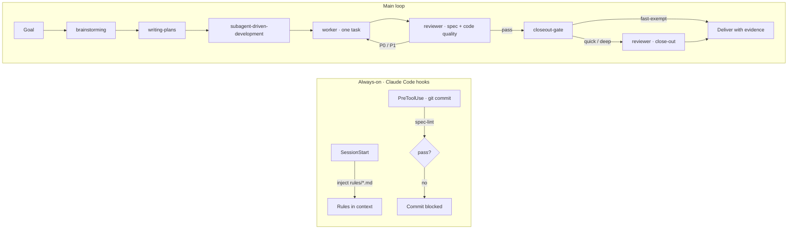

<div align="center">

# LumioAgentSpec

**One framework to manage every coding agent.**

Switch between Claude Code, Codex, Cursor, Grok and the rest. Your project's rules, context and progress stay put.

[English](README.md) · [简体中文](README.zh-CN.md)

[](https://agent-plugins.org/)
[](https://docs.anthropic.com/en/docs/claude-code)
[](CHANGELOG.md)
[](package.json)
[](LICENSE)

</div>

---

## The problem

There are a lot of coding agents now: Claude Code, Codex CLI, Cursor, GitHub Copilot, Grok, Kiro. Each is good at something different. Using one today and another tomorrow is normal.

But every switch hurts:

- **You re-teach the rules.** What you told Claude Code, Codex has never heard.
- **You re-feed the context.** What the project is, how far it got, why it was designed this way. A new agent starts from zero.
- **Every agent works its own way.** How to split tasks, how to review, what "done" means. Different per vendor, and often different per session.

So the more agents there are, the less you dare to switch. And when you do, quality drops.

## What LumioAgentSpec does

**It takes project management away from the agent and gives it to one framework. The agent just does the work.**

In three lines:

1. **Switch agents freely.** Rules, knowledge, decisions and task progress all live in a `.spec/` directory inside the repo, never in any agent's memory. Claude Code today, Codex tomorrow, same view of the project.
2. **One context, managed once.** LumioAgentSpec decides which rules are mandatory, what to read before touching code, and where to record what you learned. You never write it per agent.
3. **Quality that does not depend on the agent's mood.** Whoever writes the code does not review it. "Done" is decided by machines (lint, tests, a close-out gate), not by the agent saying so.

## Which agents

| Agent | What it gets |
|---|---|
| **Claude Code** | Everything: skills + the `.spec/` project instance + rules injected into every session + the `reviewer` sub-agent + `/lumio:init` and `/lumio:lint` + an automatic pre-commit guard |
| **Codex CLI · Cursor · GitHub Copilot · Kiro** and other clients that support the [Agent Plugins](https://agent-plugins.org/) standard | Skills + the `.spec/` project instance + an `AGENTS.md` entry pointer that tells the agent which rules to read first |
| **Grok and any agent that reads `AGENTS.md`** | The `.spec/` project instance + the `AGENTS.md` entry pointer |

Plainly: **the core is identical everywhere** (rules, knowledge, tasks, the review procedure), because it is just files in your repo. Claude Code adds automation on top: you don't have to remind it to read the rules or call for review. Other agents read the entry pointer themselves and follow the same procedure.

## Quick start

Claude Code, from the marketplace:

```bash
claude plugin marketplace add Go1c/LumioAgentSpec && claude plugin install lumio@lumioagentspec
```

Then, inside your project, once:

```bash
/lumio:init
```

This creates `.spec/` (knowledge base, decision records, task cards, plans) and appends an entry pointer to `CLAUDE.md` / `AGENTS.md`. It never overwrites existing files by default, so re-run it after a plugin upgrade to pick up new templates.

Finally fill in two blanks in `.spec/AGENTS.md`: **what the project is** and **the close-out gate command** (your lint + test command, for example). From then on, any agent opening the project knows what it is working on and what "finished" means.

Other agents need no plugin install. Load this repo's `plugin/skills/` through the Agent Plugins standard, or just let the agent read the project's `AGENTS.md`. That is enough.

## Design principles

**The main agent dispatches, sub-agents execute, skills are methods, `.md` is law.**
The main agent understands the goal, splits it, hands out work and closes out. Sub-agents only execute and never dispatch further. Skills are reusable ways of doing things. Rules are Markdown files that humans and agents both read.

**Everything goes in the repo, nothing in the agent's memory.**
What the project is, what was decided, how far it got: all in `.spec/`. Change the agent, the machine or the person, and nothing is lost.

**Rules are always present, not left to goodwill.**
In Claude Code, `rules/*.md` is injected at the start of every session. Adding a rule means adding a file. There is no registry, so nothing can be "forgotten to register".

**The writer never reviews their own work.**
The only functional sub-agent is `reviewer`. Its job is to assume your delivery is broken and prove it. Self-review is treated as a known degradation, never the default.

**"Done" is decided by a machine.**
`closeout-gate` looks at the diff and decides whether a review is needed and how deep. `spec-lint` runs before every commit and blocks it on failure. An agent saying "passed" counts for nothing without the command and its output.

**Decisions are appended, never rewritten.**
One ADR per decision. Overturn it by adding a new one and marking the old as superseded. History stays, and agents stop asking "why was it designed this way" over and over.

**Disclose on demand.**
Only the rules are resident. Skills, dispatch templates and the review checklist are read when needed. The context stays uncluttered, so the agent has room to think.

## How it runs



## What's inside

Eleven skills. Each one is a "when this happens, do it this way":

| Skill | When to use it |
|---|---|
| `before-you-code` | Before touching code: read what matters, decide how deep to go. |
| `brainstorming` | Building something new: get intent, requirements and design clear first. |
| `writing-plans` | Design is settled: write the step-by-step implementation plan. |
| `task-breakdown` | The goal is too big or vague: split it into non-overlapping task cards with acceptance criteria. |
| `subagent-driven-development` | Work through the plan one task at a time, reviewing after each. |
| `test-driven-development` | Any feature or fix. No production code without a failing test first. |
| `systematic-debugging` | Hit a bug: find the root cause, no fixes before that. |
| `using-git-worktrees` | Isolated workspaces, then merging and cleaning up. |
| `verification-before-completion` | About to say "done": run the verification commands first. |
| `receiving-code-review` | Got review feedback: verify it before acting on it. |
| `spec-steward` | Finished a change: record new knowledge and conventions in `.spec/`. |

Plus: one review sub-agent (`reviewer`), two commands (`/lumio:init`, `/lumio:lint`), two hooks (inject rules, guard commits), two resident rule files (`system.md` hard red lines, `dispatch.md` dispatch procedure), and a handful of pure Node scripts (two linters, `closeout-gate`, the scaffold). Zero runtime dependencies.

## Repository layout

This repo is both the plugin and a project that uses it. Users install `plugin/` only.

```
LumioAgentSpec/
├── plugin/            # ★ Publish surface: skills/ agents/ commands/ hooks/ rules/ templates/ tools/
├── .claude-plugin/    # marketplace.json
├── tests/             # Development surface, never shipped
└── .spec/             # This repo's own project instance, never shipped
```

## Development

```bash
node plugin/tools/plugin-lint.mjs && node plugin/tools/spec-lint.mjs && node --test tests/*.test.mjs && claude plugin validate . --strict
```

Live reload while developing: symlink `~/.claude/skills/lumio` to this repo's `plugin/`. Edits take effect immediately.

Add a rule by dropping a file into `rules/`. Add a skill with `spec-steward`. Record a decision as a new ADR. Run `/lumio:lint` when done.

## License

[MIT](LICENSE)
