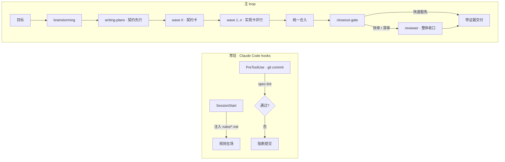

<div align="center">

# LumioAgentSpec

**一套框架，管住所有编码 Agent。**

换 Claude Code、Codex、Cursor、Grok…… 随便换，项目的规则、上下文、进度一个都不丢。

[English](README.md) · [简体中文](README.zh-CN.md)

[](https://agent-plugins.org/)
[](https://docs.anthropic.com/en/docs/claude-code)
[](CHANGELOG.md)
[](package.json)
[](LICENSE)

</div>

<!-- lumio-community:start -->
<div align="center">
<table>
<tr>
<td align="center" width="50%" valign="top">
<a href="https://qm.qq.com/q/PGkXh4tCyQ"></a><br>
<a href="https://qm.qq.com/q/PGkXh4tCyQ"></a><br>
<sub>什么都能聊</sub>
</td>
<td align="center" width="50%" valign="top">
<a href="https://applink.feishu.cn/client/chat/chatter/add_by_link?link_token=7bbl451c-aa1d-4e6d-a21c-fd1f1ebeb6b5"></a><br>
<a href="https://applink.feishu.cn/client/chat/chatter/add_by_link?link_token=7bbl451c-aa1d-4e6d-a21c-fd1f1ebeb6b5"></a><br>
<sub>飞书话题群 · Agent 与项目管理</sub>
</td>
</tr>
</table>
<sub>先进群再看代码。其它群和整体介绍见 <a href="https://github.com/LumioGames">LumioGames 主页</a>。</sub>
</div>
<!-- lumio-community:end -->

---

## 我们解决什么问题

现在的编码 Agent 很多：Claude Code、Codex CLI、Cursor、GitHub Copilot、Grok、Kiro…… 各有各的强项，你今天用这个、明天想换那个，很正常。

但一换就麻烦：

- **规则要重新教。** 你在 Claude Code 里立的规矩，Codex 不知道。
- **上下文要重新喂。** 项目是什么、做到哪了、为什么这么设计，换个 Agent 全部从零开始。
- **每个 Agent 一套做法。** 拆任务、审代码、什么叫「做完了」，每家标准都不一样，甚至同一家每次都不一样。

结果就是：Agent 越多，你越不敢换；换了，质量就掉。

## LumioAgentSpec 怎么解决

**把「管项目」这件事从 Agent 手里拿回来，交给一套框架。Agent 只负责干活。**

三句话：

1. **任意切换 Agent。** 项目的规则、知识、决策、任务进度全部放在仓库里的 `.spec/` 目录，不放在任何一个 Agent 的记忆里。今天用 Claude Code，明天开 Codex，看到的是同一套东西。
2. **只有一套上下文。** 由 LumioAgentSpec 统一管理：哪些规则必须遵守、动手前该读什么、做完了该沉淀到哪。你不用给每个 Agent 单独写一遍。
3. **质量不看 Agent 心情。** 写代码的不审自己的代码；「做完了」由机器判定（lint、测试、收口门槛），不是 Agent 说完就算。

## 支持哪些 Agent

| Agent | 拿到什么 |
|---|---|
| **Claude Code** | 全部：技能 + `.spec/` 项目实例 + 规则每次会话自动注入 + `reviewer` 审查子 Agent + `/lumio:init` `/lumio:lint` 命令 + 提交前自动拦截 |
| **Codex CLI · Cursor · GitHub Copilot · Kiro** 等支持 [Agent Plugins](https://agent-plugins.org/) 标准的客户端 | 技能 + `.spec/` 项目实例 + `AGENTS.md` 入口指针（告诉 Agent 先读哪些规则） |
| **Grok 及任何会读 `AGENTS.md` 的 Agent** | `.spec/` 项目实例 + `AGENTS.md` 入口指针 |

说人话：**核心的那套东西（规则、知识、任务、审查规程）在所有 Agent 里都一样**，因为它们就是仓库里的文件。Claude Code 多出来的是自动化（不用你提醒它读规则、不用你手动喊审查），其他 Agent 靠入口指针主动读，同样能跑通。

## 快速开始

Claude Code 从 marketplace 安装：

```bash
claude plugin marketplace add LumioGames/LumioAgentSpec && claude plugin install lumio@lumioagentspec
```

然后在你的项目里跑一次：

```bash
/lumio:init
```

它会在项目里生成 `.spec/` 目录（知识库、决策记录、任务卡、计划），并往 `CLAUDE.md` / `AGENTS.md` 追加一段入口指针。默认不覆盖任何已有文件，升级插件后再跑一次就能补齐新模板。

最后填 `.spec/AGENTS.md` 里的两处空：**项目是什么**、**收口门槛命令**（比如你的 lint + 测试命令）。填好之后，任何 Agent 打开这个项目都知道自己在干什么、什么叫干完。

其他 Agent 不用装插件：把这个仓库的 `plugin/skills/` 按 Agent Plugins 标准接入，或者直接让 Agent 读项目里的 `AGENTS.md`，就够了。

## 设计理念

**主 Agent 调度，子 Agent 执行，Skill 是方法，`.md` 是规则。**
主 Agent 负责理解目标、拆任务、派活、收口。子 Agent 只干活，不再往下派。技能是可以复用的做事方法。规则就是 Markdown 文件，人和 Agent 都能读。

**一切进仓库，不进 Agent 的记忆。**
项目是什么、定过什么决策、做到哪了，全在 `.spec/`。换 Agent、换机器、换人，都不丢。

**规则常驻，不靠自觉。**
Claude Code 里，`rules/*.md` 每次会话开头自动注入。新加一条规则就是新加一个文件，没有登记表，也就没有「忘了登记」。

**写的人不审自己。**
唯一的职能子 Agent 是 `reviewer`，它的任务是假设你的交付有问题，然后去证明。自己审自己，被当作已知降级，从不是默认。

**「做完了」由机器说了算。**
`closeout-gate` 看 diff 决定要不要审、审多深；提交前自动跑 `spec-lint`，不过就拦。Agent 说「已通过」不算数，要贴命令和输出。

**决策只增不改。**
每个决策一条 ADR，推翻了就新增一条、把旧的标成被取代。历史永远在，Agent 不会在同一个坑里反复问「为什么这么设计」。

**按需披露。**
常驻的只有规则；技能、派活模板、审查清单用到再读。上下文不被塞满，Agent 才有脑子干活。

## 它是怎么跑的



## 里面有什么

6 个技能，每个就是一份「遇到这种情况该怎么做」：

| 技能 | 什么时候用 |
|---|---|
| `brainstorming` | 要做新东西了，先把意图、需求、设计聊明白。 |
| `writing-plans` | 设计定了，写分步实现计划；或先剥出契约卡，再拆成互不重叠的任务卡。 |
| `subagent-driven-development` | 契约卡先合入，实现卡按 wave 并行派出，全部合入后统一审一次。 |
| `test-driven-development` | 大任务先写失败测试再写代码；小任务免。 |
| `systematic-debugging` | 遇到 bug 先找根因，找到之前不许改。 |
| `spec-steward` | 改完东西，把新知识、新规范沉淀进 `.spec/`。 |

再加：一个审查子 Agent `reviewer`，两条命令 `/lumio:init` `/lumio:lint`，两个 hook（注入规则、拦提交），两份常驻规则（`system.md` 硬红线、`dispatch.md` 调度规程），以及几支纯 Node 脚本（两支 lint、`closeout-gate` 定级、脚手架）。零运行时依赖。

## 仓库结构

本仓库既是插件本体，也是用它的项目。用户装到的只有 `plugin/`。

```
LumioAgentSpec/
├── plugin/            # ★ 发布面：skills/ agents/ commands/ hooks/ rules/ templates/ tools/
├── .claude-plugin/    # marketplace.json
├── tests/             # 开发面，不下发
└── .spec/             # 本仓自己的项目实例，不下发
```

## 开发

```bash
node plugin/tools/plugin-lint.mjs && node plugin/tools/spec-lint.mjs && node --test tests/*.test.mjs && claude plugin validate . --strict
```

开发期实时加载：把 `~/.claude/skills/lumio` 软链到本仓的 `plugin/`，改动立即生效。

加规则就往 `rules/` 丢文件；加技能用 `spec-steward`；做决策写新 ADR。改完跑 `/lumio:lint`。

## 许可证

[MIT](LICENSE)
