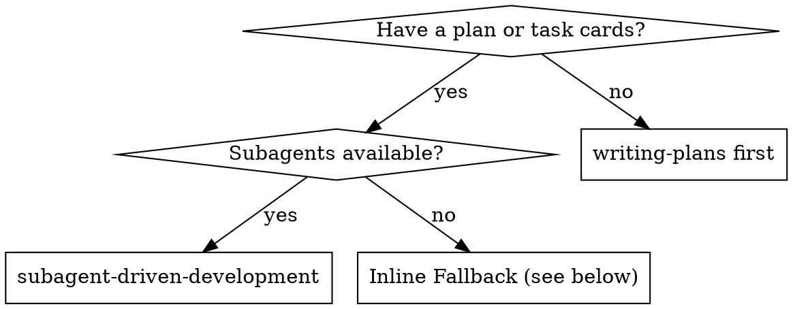

# Subagent-Driven Development

Execute a plan by dispatching fresh implementer subagents **wave by wave**: the contract card(s) first, then each wave's implementation cards in parallel (non-overlapping file sets, isolated worktrees), merge, and hand the merged diff to **one** closeout review.

**Why subagents:** You delegate tasks to specialized agents with isolated context. By precisely crafting their instructions and context, you ensure they stay focused and succeed at their task. They should never inherit your session's context or history — you construct exactly what they need. This also preserves your own context for coordination work.

**Core principle:** contract first + parallel waves + one review of the merged whole = fast iteration without cross-worker drift. The parallel boundary, merge policy and review timing have a single authority — `rules/dispatch.md`(「并行边界与合入」「审查闭环」「收口门槛」); this skill only operationalises them.

**Narration:** between tool calls, narrate at most one short line — the ledger and the tool results carry the record.

**Continuous execution:** Do not pause to check in with the user between cards or waves. The only reasons to stop are: BLOCKED status you cannot resolve, ambiguity that genuinely prevents progress, a plan contradiction (Pre-Flight), or all cards complete. "Should I continue?" prompts and progress summaries waste their time.

## When to Use



## The Process

1. **Read the plan once.** Note Global Constraints, create todos per card, set the plan's frontmatter to `status: in_progress`. Check the ledger (Durable Progress) — cards marked complete there are done.
2. **Pre-flight plan review** (below).
3. **Wave 0 — contract cards.** Dispatch the implementer(s) for the shared dependencies: types / data structures, API signatures, protocols, common modules, conventions. A contract card is done when its artefacts exist, lint and type check pass, and the ledger records it. **Never fan out wave 1 before wave 0 is merged** — implementation workers align only through the contract artefacts. A contract that proves insufficient is fixed on the contract card, never widened inside an implementation card.
4. **Wave N — implementation cards, in parallel.** For every card in the wave: record the BASE commit, run `scripts/task-brief PLAN_FILE N`, and dispatch an implementer (./implementer-prompt.md) in its own isolated worktree (Claude Code: Agent tool `isolation: "worktree"`; the 【文件集边界】 / 【环境】 lines come from `references/dispatch-templates.md`). Cards with overlapping file sets or an unresolved dependency edge go to a later wave, never side by side.
5. **Collect the wave.** Handle each implementer status (below). A worker's report carries its own lint + covering-test evidence — do not re-run those tests. Merge each passing worktree into the main workspace; conflicts go back to the implementer. Append one ledger line per card.
6. **Next wave** until every card is done.
7. **Closeout.** Run `closeout-gate` for the review level; run the project's full 收口门槛 **once**; generate `scripts/review-package MERGE_BASE HEAD` (MERGE_BASE = `git merge-base main HEAD`) and dispatch the closeout reviewer (./code-reviewer.md) with the printed path. Findings → ONE fix subagent carrying the complete list → re-review. Then set the plan to `status: completed` and finish the branch per `rules/dispatch.md`「并行边界与合入」.

**Per-card review is not part of the loop.** The one exception: a card touching the red-line surface (`rules/`, hooks, `.claude/`, CI config, auth / security) is reviewed **before** it is merged, with ./task-reviewer-prompt.md.

## Pre-Flight Plan Review

Before dispatching wave 0, scan the plan once for conflicts:

- cards that contradict each other or the plan's Global Constraints
- a wave whose cards share a file or have a dependency edge between them (fix the schedule, not the cards)
- anything the plan explicitly mandates that the review rubric treats as a defect (a test that asserts nothing, verbatim duplication of a logic block)

Present everything you find to the user as one batched question — each finding beside the plan text that mandates it, asking which governs — before execution begins, not one interrupt per discovery mid-plan. If the scan is clean, proceed without comment. The closeout review remains the net for conflicts that only emerge from implementation.

## Model Selection

Use the least powerful model that can handle each role, and name it explicitly in every dispatch — an omitted model inherits the session's, often the most capable and most expensive. When genuinely unsure, inherit rather than guess low: cheap models take 2-3× the turns on multi-step work and cost more overall.

| Work | Model tier |
|------|-----------|
| Transcription-grade implementation (plan text contains the complete code); single-file mechanical fixes | cheapest |
| Implementation from prose specs; contract cards | mid-tier (the floor for these roles) |
| Multi-file integration, debugging | standard |
| Architecture and design; the closeout whole-branch review | most capable available |

## Handling Implementer Status

Implementer subagents report one of four statuses. Handle each appropriately:

**DONE:** Confirm the report contains the covering tests, the command run, and the output (a bare "tests pass" is not evidence). Merge the worktree, record the ledger line. Red-line cards only: generate `scripts/review-package BASE HEAD` (BASE is the commit you recorded before dispatch — never `HEAD~1`, which silently drops all but the last commit of a multi-commit task) and dispatch the task reviewer before merging.

**DONE_WITH_CONCERNS:** The implementer completed the work but flagged doubts. Read the concerns before merging. If they are about correctness, scope, or the contract, address them before the merge. If they are observations (e.g. "this file is getting large"), note them in the ledger for the closeout reviewer and proceed.

**NEEDS_CONTEXT:** The implementer needs information that wasn't provided. Provide the missing context and re-dispatch.

**BLOCKED:** The implementer cannot complete the task. Assess the blocking condition:
1. If it's a context problem, provide more context and re-dispatch with the same model
2. If the task requires more reasoning, re-dispatch with a more capable model
3. If the task is too large, break it into smaller pieces
4. If the contract is wrong, fix the contract card first, then re-dispatch the affected cards
5. If the plan itself is wrong, escalate to the human

**Never** ignore an escalation or force the same model to retry without changes. If the implementer said it's stuck, something needs to change.

## Handling Reviewer ⚠️ Items

The closeout reviewer may report "⚠️ Cannot verify from diff" items — requirements that live in unchanged code or span cards. These do not block the rest of the review, but you must resolve each one yourself before closing: you hold the plan and cross-card context the reviewer lacks. If you confirm an item is a real gap, treat it as a failed review — dispatch the fix and re-review.

## Constructing Reviewer Prompts

- Do not add open-ended directives like "check all uses" or "run race tests if useful" without a concrete, task-specific reason
- Do not ask a reviewer to re-run tests the implementers already ran on the same code — their reports carry the test evidence; the reviewer replays only the 收口门槛 and the one most critical claim (快审) or more (深审) per `agents/reviewer.md`
- Do not pre-judge findings for the reviewer — never instruct a reviewer to ignore or not flag a specific issue. If you believe a finding would be a false positive, let the reviewer raise it and adjudicate it in the review loop. If the prompt you are writing contains "do not flag," "don't treat X as a defect," "at most P2," or "the plan chose" — stop: you are pre-judging, usually to spare yourself a review loop.
- The global-constraints block you hand the reviewer is its attention lens. Copy the binding requirements verbatim from the plan's Global Constraints section or the spec: exact values, exact formats, and the stated relationships between components ("same layout as X", "matches Y"). The reviewer's template already carries the process rules (YAGNI, test hygiene, review method) — the constraints block is for what THIS project's spec demands.
- Hand the reviewer its diff as a file: run this skill's `scripts/review-package MERGE_BASE HEAD` and pass the printed path (or, without bash: `git log --oneline`, `git diff --stat`, and `git diff -U10` for the range, redirected to one uniquely named file). The output never enters your own context, and the reviewer sees the commit list, stat summary, and full diff with context in one Read call.
- Point the closeout reviewer at the ledger's list of observations and P2-grade concerns collected from the workers, so it can triage which must be fixed before merge. A roll-up nobody reads is a silent discard.
- A finding labeled plan-mandated — or any finding that conflicts with what the plan's text requires — is the human's decision, like any plan contradiction: present the finding and the plan text, ask which governs. Do not dismiss the finding because the plan mandates it, and do not dispatch a fix that contradicts the plan without asking.
- Every fix dispatch carries the implementer contract: the fix subagent re-runs the tests covering its change and reports the results. Name the covering test files in the dispatch — a one-line fix does not need the whole suite. Before re-dispatching the reviewer, confirm the fix report contains the covering tests, the command run, and the output.
- If the closeout review returns findings, dispatch ONE fix subagent with the complete findings list — not one fixer per finding. Per-finding fixers each rebuild context and re-run suites; a real session's fix wave cost more than all its tasks combined.

## File Handoffs

Everything you paste into a dispatch prompt — and everything a subagent prints back — stays resident in your context for the rest of the session and is re-read on every later turn. Hand artifacts over as files:

- **Task brief:** before dispatching an implementer, run this skill's `scripts/task-brief PLAN_FILE N` — it extracts the card's full text to a uniquely named file and prints the path. Compose the dispatch so the brief stays the single source of requirements. Your dispatch should contain: (1) one line on where this card fits in the project and which wave it is in; (2) the brief path, introduced as "read this first — it is your requirements, with the exact values to use verbatim"; (3) the contract artefacts from wave 0 the card consumes (paths, not pasted contents) and the 【文件集边界】 line; (4) your resolution of any ambiguity you noticed in the brief; (5) the report-file path and report contract. Exact values (numbers, magic strings, signatures, test cases) appear only in the brief and the contract files.
- **A dispatch prompt describes one card, not the session's history.** Do not paste accumulated prior-wave summaries into later dispatches — a real session's dispatch hit 42k chars of which 99% was pasted history. A fresh subagent needs its card, the contract artefacts it touches, and the global constraints. Nothing else.
- **Report file:** name the implementer's report file after the brief (brief `…/task-N-brief.md` → report `…/task-N-report.md`) and put it in the dispatch prompt. The implementer writes the full report there and returns only status, commits, a one-line test summary, and concerns.
- **Reviewer inputs:** the closeout reviewer gets the plan path, the review package, the ledger, and the global constraints that bind the work. A red-line card's reviewer gets that card's brief, report and package.
- Fix dispatches append their fix report (with test results) to a report file and return a short summary; re-reviews read the updated file.

## Durable Progress

Conversation memory does not survive compaction. In real sessions, controllers that lost their place have re-dispatched entire completed waves — the single most expensive failure observed. Track progress in a ledger file, not only in todos.

- At skill start, check for a ledger: `cat "$(git rev-parse --show-toplevel)/.sdd/progress.md"`. Cards listed there as complete are DONE — do not re-dispatch them; resume at the first wave with an incomplete card.
- When a card is merged, append one line to the ledger in the same message as your other bookkeeping: `Task N (wave W): complete (commits <base7>..<head7>, merged)`. Worker concerns and observations go on the following lines, prefixed `note:` — the closeout reviewer reads them.
- The ledger is your recovery map: the commits it names exist in git even when your context no longer remembers creating them. After compaction, trust the ledger and `git log` over your own recollection.
- `git clean -fdx` will destroy the ledger (it's git-ignored scratch); if that happens, recover from `git log`.
- Plan frontmatter mirrors the coarse state: set `status: in_progress` when execution starts and `status: completed` when the closeout review passes (enum enforced by spec-lint).

## Prompt Templates

- [implementer-prompt.md](implementer-prompt.md) - Dispatch an implementer subagent (contract or implementation card)
- [code-reviewer.md](code-reviewer.md) - Dispatch the closeout whole-branch reviewer
- [task-reviewer-prompt.md](task-reviewer-prompt.md) - Dispatch a single-card reviewer — **red-line cards only**, before merge

## Example Workflow

```
You: I'm using Subagent-Driven Development to execute this plan.

[Read plan once: .spec/plans/feature-plan.md — 1 contract card, 3 implementation cards in 2 waves]
[Create todos; set plan status: in_progress; ledger empty]

Wave 0 — Task 1: shared types + API signatures
[task-brief 1; dispatch implementer; DONE with lint + tsc output]
[Merge worktree; ledger: Task 1 (wave 0): complete]

Wave 1 — Tasks 2 and 3 in parallel (disjoint file sets, both consume src/types.ts)
[task-brief 2, task-brief 3; dispatch two implementers, each with isolation: "worktree"]
Implementer 2: DONE — 5/5 covering tests pass, committed
Implementer 3: DONE_WITH_CONCERNS — "the retry contract has no max-attempts field"
[Concern touches the contract → dispatch a contract fix on Task 1's files; re-dispatch Task 3 with the updated contract]
[Merge both; ledger updated with note: lines]

Wave 2 — Task 4 (depends on 2 and 3)
[task-brief 4; dispatch; DONE; merge; ledger]

Closeout
[closeout-gate → 快审; run full 收口门槛 once: green]
[review-package MERGE_BASE HEAD; dispatch closeout reviewer with the path + ledger]
Reviewer: 通过, 1 × P2 (naming) → fix subagent with the full list → re-review: 通过
[plan status: completed; finish branch per rules/dispatch.md]
```

## Red Flags

**Never:**
- Start implementation on main/master branch without explicit user consent
- Fan out an implementation wave before its contract cards are merged
- Dispatch cards with overlapping file sets — or an unresolved dependency edge — in the same wave (non-overlapping cards fan out in parallel per `rules/dispatch.md`「并行边界与合入」)
- Let an implementation card widen a contract on its own — the contract card changes, then the dependants re-dispatch
- Merge a card whose report lacks the covering tests, the command and the output
- Re-run a worker's tests yourself or in a reviewer — the report is the evidence; the full suite runs once at closeout
- Skip the closeout review, or accept a report missing either verdict (spec compliance AND quality)
- Make a subagent read the whole plan file (hand it its task brief — `scripts/task-brief` — instead)
- Skip scene-setting context (subagent needs to understand where its card fits and which wave it is in)
- Ignore subagent questions (answer before letting them proceed)
- Tell a reviewer what not to flag, or pre-rate a finding's severity in the dispatch prompt — the plan's example code is a starting point, not evidence that its weaknesses were chosen
- Dispatch the closeout reviewer without a diff file — generate it first (`scripts/review-package MERGE_BASE HEAD`) and name the printed path in the prompt
- Close while the review has open P0/P1 issues
- Re-dispatch a card the progress ledger already marks complete — check the ledger (and `git log`) after any compaction or resume

**If subagent asks questions:** answer clearly and completely; provide additional context if needed; don't rush them into implementation.

**If the closeout reviewer finds issues:** one fix subagent with the full list → reviewer reviews again → repeat until approved. Don't skip the re-review.

**If a subagent fails its card:** dispatch a fix subagent with specific instructions; don't fix manually (context pollution).

## Integration

**Subagents should use:**
- **test-driven-development** — for large cards, per `rules/dispatch.md`「编码约定 · 测试分级」; small cards run existing tests only

**Workspace isolation and branch finishing** follow `rules/dispatch.md`「并行边界与合入」— no separate skill.

## Inline Fallback (No Subagents)

When the host has no subagent support, execute the plan inline in this session:

1. **Load and review the plan critically.** Concerns → raise them with the user before starting. No concerns → create todos for the cards and set the plan file's frontmatter to `status: in_progress`.
2. **Contract cards first, then the rest in wave order** (waves collapse to serial execution). For each card: mark in_progress → follow its steps exactly as written → run the verifications it specifies (covering tests only) → mark complete.
3. **Stop and ask instead of guessing** when you hit a blocking condition: missing dependency, failing test, unclear instruction, repeated verification failure.
4. **After all cards complete,** run the full 收口门槛 once, do one adversarial self-review of the whole diff against `agents/reviewer.md`, set the plan's frontmatter to `status: completed`, then finish the branch per `rules/dispatch.md`.

This mode loses fresh-context-per-card and independent review — a known degradation. Apply extra skepticism when self-reviewing.
